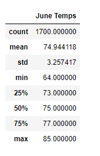
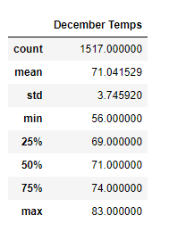

# Surfs Up
For this project we are assisting a college in sharing data with possible investor, W.Avy. We are analyzing temperature trends to determine whether Oahu, HI would be a sustainable year-round place to open a surf and ice cream shop. 

Resources:
* SQLite
* SQLAlchemy
* Python
* Pandas
* Flask

W.Avy shared a Hawaii weather SQL database file for temperature analysis. This information allowed us to quickly build a useful visible dataset. We want to make sure the temperatures are nice all year long so we have broken it down to June and December temps.

## Deliverable 1: Determine the Summary Statistics for June 

## Deliverable 2: Determine the Summary Statistics for December

## Results 
Looking at our summary statistic results we can see that the temperatures overall differ very little from June and December. 
Temperature difference between June and December:
* Average temperature difference: 3.9°F
* Maximum temperature difference: 2°F
* Minimum temperature difference: 8°F

## Summary 
Our analysis demonstrates that the weather in Oahu is consistently good all year round. The conditions are favorable for potential tourism, surfing and ice cream revenues. This means that it is more likely we can convince W.Avy to invest. More analysis on the precipitation levels as well as the more specific locations on the island could help garner more useful information for the future if they decide to open a new shop.
